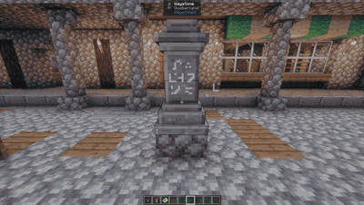

# Aki's Grand Theft Neo Teleport Cam Reforged

**[Product of Achilleus](https://linktr.ee/achilleus_)** — Created and maintained by [Achilleus (Achilleus-1)](https://github.com/Achilleus-1).

Cinematic teleport transitions. Settings: NeoForge Mods screen or `/gtp config`. Uses Minecraft sound replacements.

## Demo

## Installation

For **Minecraft 1.21.1**, **NeoForge 21.1.255**, and **Java 21**. Download `akis-grand-theft-neo-teleport-cam-reforged-1.21.1-1.0.0-neoforge.4.jar` from [Releases](https://github.com/Achilleus-1/Akis-GrandTheftNeoTeleportCam-Reforged/releases/latest) and place it in your `mods` folder. Remove older copies first.

## Development

Source code is in `src/main/java/`. Mod resources, logos, translations, and metadata are in `src/main/resources/`. Existing internal IDs and configuration paths are preserved.

Build with a Java 21 JDK: `./gradlew build` on Linux/macOS or `.\gradlew.bat build` on Windows. The installable JAR is written to `build/libs/`.

Launch the development client with `./gradlew runClient` or `.\gradlew.bat runClient`. Mod information and Minecraft/NeoForge versions are configured in `gradle.properties`. GitHub Actions checks the build on pushes and pull requests.

## Attribution

Ported from [Grand Teleport](https://github.com/hookuru/GrandTeleport) by hookuru_.

Licensed under **MIT**; copyright and license notices are included in [LICENSE](LICENSE) and packaged resources.

## Development and reuse

See [DEVELOPMENT.md](DEVELOPMENT.md) for reproducible checks and known archival dependencies, [CONTRIBUTING.md](CONTRIBUTING.md) for contribution guidance, and [SECURITY.md](SECURITY.md) for private reports.
